# 杀戮尖塔 Mod 开发的 Patch 指南

（本文作者：RS76）

- [杀戮尖塔 Mod 开发的 Patch 指南](#杀戮尖塔-mod-开发的-patch-指南)
  - [1. 概述](#1-概述)
  - [2. SpirePatch 的一般规则](#2-spirepatch-的一般规则)
    - [@SpirePatch 参数](#spirepatch-参数)
    - [Patch 的加载顺序](#patch-的加载顺序)
  - [3. 一般的 Patch 技术](#3-一般的-patch-技术)
    - [Prefix](#prefix)
      - [可用特性](#可用特性)
    - [Postfix](#postfix)
      - [可用特性](#可用特性-1)
    - [Insert](#insert)
      - [@SpireInsertPatch 参数](#spireinsertpatch-参数)
      - [可用特性](#可用特性-2)
      - [Locator](#locator)
    - [Replace](#replace)
    - [SpireField](#spirefield)
    - [SpireOverride](#spireoverride)
    - [SpireEnum](#spireenum)
  - [4. Patch 可用的特性](#4-patch-可用的特性)
    - [@ByRef](#byref)
    - [Private Field Captures](#private-field-captures)
      - [参数的顺序](#参数的顺序)
    - [SpireReturn](#spirereturn)
  - [5. 进阶 Patch 技术](#5-进阶-patch-技术)
    - [Instrument](#instrument)
    - [Raw](#raw)
  - [6. 编译 Patch 后的代码](#6-编译-patch-后的代码)
  - [FAQ](#faq)

## 1. 概述

本教程基于 ModTheSpire 的 Wiki 上所提供的 Patch 教程，攥写 Patch 需要有足够的 Java 和 Javassist 知识，对于其中涉及的 Java 原理，本教程不提供任何的解释。SpirePatch 允许 Mods 将自己的代码写入杀戮尖塔原本的代码中。当一个 Mod 被加载时，ModTheSpire 首先搜寻该 Mod 中所有带有 @SpirePatch 注解的类。也就是说，对于每个你想要插入代码的原版方法，你必须创建一个带有 @SpirePatch 注解的类。

ModTheSpire 还提供了一个较新的 Patch 类型，SpirePatch2。它对 Patch 方法参数的处理方式与最基本的 SpirePatch 有所区别。在阅读 SpirePatch2 的指南前，你需要对 SpirePatch 的工作原理有足够的理解。当然，SpirePatch2 的指南你得自己上 ModTheSpire 的 Wiki 看，因为它本身没啥难度。

本教程会介绍下列类型的 Patch：

* [Prefix](#prefix)
* [Postfix](#postfix)
* [Insert](#insert)
* [Replace](#replace)
* [SpireField](#spirefield)
* [SpireOverride](#spireoverride)
* [SpireEnum](#spireenum)
* [Instrument](#instrument)
* [Raw](#raw)

对于刚入门 Mod 制作且想要写 Patch 的新手，请**仔细并认真且耐心地一步步地从头到尾一字不拉地同时完完全全地在不跳行、不跳字的情况下**阅读完本篇教程。

对于刚写 Patch 时遇到难以解决的问题的新手，在阅读完教程的主要部分后，请先**仔细并认真且耐心地一步步地从头到尾一字不拉地同时完完全全地在不跳行、不跳字的情况下**阅读 [FAQ](#faq) 部分。

若 FAQ 部分无法解答你的疑惑，可以到 Mod 交流群**直接说出**你想要实现的具体效果并贴出你为了实现这个效果正在写的 Patch 代码进行提问。

## 2. SpirePatch 的一般规则

* Patch 类如果是**嵌套类**，那它必须是**静态嵌套类**。
* Patch 方法必须是**静态方法**。
* Patch 类需有 @SpirePatch 注解。
* Patch 方法接收所有**原方法（被 Patch 的方法）**的参数。当且仅当原方法是**非静态**方法，Patch 方法还接收（被）Patch 的**原方法所属的类的实例**（Instance）参数。示例如下。

```java
public static void [Patch方法名]([实例类型] __instance, [参数列表]...) {...}
```

* Patch 方法**按顺序**接收参数，实例在前，然后是**原方法的参数顺序**。一般地，实例和参数名不影响接收的顺序。
* Patch 方法接收参数的逻辑与一般的 Java 没有区别，即**按值接收**，而不是按引用接收。
  * Java 方法接收的参数是原值 A 的一个复制 A1，A 和 A1 指向同个引用。因此修改 A1.value 也会同时修改 A.value，但给 A1 赋新值并不影响 A 本身。

### @SpirePatch 参数

* `clz` 定义包含需要（被）Patch 的原方法的类，接收 Class<?> 类型。
* `cls` 定义包含需要（被）Patch 的原方法的类，接收 String 类型。必须是完整的类路径和类名。
* `method` 定义需要（被）Patch 的原方法 [名] ，接收 String 类型。
  * 使用 `SpirePatch.CONSTRUCTOR` 来定义构造体。
  * 使用 `SpirePatch.STATICINITIALIZER` 来定义静态初始化块。
  * 使用 `SpirePatch.CLASS` 来定义类。
* `paramtypez` 定义需要（被）Patch 的原方法的参数类型，接收 Class<?> 类型的数组（当原方法有多个重载，即同名方法，时需要填写该参数，无参方法的写法为 `paramtypez = {}` ）
* `paramtypes` 定义需要（被）Patch 的原方法的参数类型，接收 String 类型的数组。必须填写参数类型完整的类路径和类名。
* `requiredModId` 定义该 Patch 方法加载时所需加载的 Mod 的 ID，接收 String 类型。
  * 用于跨 Mod 直接进行 Patch.
  * 当 Mod ID 所指明的 Mod 加载了但 Patch 失败时会产生错误。
* `optional` 当设为 true 时，如果需要（被）Patch 的类和方法不存在时（例如跨 Mod 但另一个 Mod 未加载），该 Patch 会被忽略。
  * 当 Patch 失败时不会产生错误。

下面是对 AbstractPlayer 类中 useCard 方法 Patch 的示例。

```java
@SpirePatch(clz = AbstractPlayer.class, method = "useCard", 
            paramtypez = {AbstractCard.class, AbstractMonster.class, int.class})
public class ExamplePatch {
    @SpirePrefixPatch
    public static void Prefix(AbstractPlayer __instance, AbstractCard c, AbstractMonster m, int e) {
        ...
    }
}
```

注意，原方法 useCard 并无重载，因此 paramtypez 不是必填的。

### Patch 的加载顺序

Patch 首先按类型进行加载，然后按 Mod 顺序进行加载。按类型加载的先后顺序为：Insert，Instrument，Replace，Prefix，Postfix，Raw. 这意味着所有的 Insert Patch 都会在 Instrument Patch 之前加载，等等。如果有 2 个及以上正在加载的 Mod 同时定义了相同类型的 Patch ，这些 Patch 会按 Mod 在 ModTheSpire 中的顺序进行加载。如果一个 Mod 定义多个相同类型的 Patch，这些 Patch 会按任意顺序加载。


## 3. 一般的 Patch 技术


### Prefix

------

Prefix 会在原方法的最开始插入你的 Patch 方法。

你可以使用 `@SpirePrefixPatch` 注解来定义一个 Prefix 类型的 Patch 方法。

<font color = red>注意，ModTheSpire 优先按照 Patch 方法名判断该 Patch 的类型，因此一个方法名为 Postfix 但带有 `@SpirePrefixPatch` 注解的 Patch 方法会被视为 Postifx 而不是 Prefix.</font>  部分其他类型的 Patch 同样适用该规则，下不提醒。

下面是对 AbstractPlayer 中的 draw 方法插入 Prefix Patch 的实例，以及插入前和插入后反编译出的源码效果。注意 draw 方法有 2 个重载，因此需要填写 paramtypez 参数。往后 Patch 实例不再详细解释。

```java
@SpirePatch(clz = AbstractPlayer.class, method = "draw", paramtypez = {int.class})
public static class ExamplePrefixPatch {
    // 此处使用注解 @SpirePrefixPatch 来定义 prefix 类型的 patch 方法
    // 亦可通过将方法名从 ExampleMethod 改为 Prefix 来定义 prefix 类型的 patch 方法
    @SpirePrefixPatch
    // 按照一般规则，该 patch 方法应该接收两个参数——原方法所属类的一个实例，以及原方法的唯一一个参数
    // 接收原方法所属类的一个实例的参数为 _inst，接收原方法的原参数（numCards）的参数为 num
    public static void ExampleMethod(AbstractPlayer _inst, int num) {
        System.out.printf("[%s] draws [%d] cards", _inst.name, num);
    }
}
```


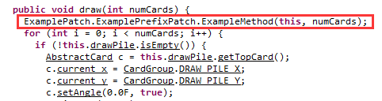

#### 可用特性

* [@ByRef](#byref)
* [Private Field Captures](#private-field-captures)
* [SpireReturn](#spirereturn)

### Postfix

------

Posfix 会在原方法的最后插入你的 Patch 方法。如果原方法有返回值的话，那么 Postfix 总会在 return 之前插入，这意味这你可以通过 Posfix 更改原方法的返回值，即 retVal = postfix( foobar(params) ).

若要修改原方法的返回值，可在 Patch 方法的参数列表中添加一个类型为原方法返回值类型的参数，**该参数必须是 Patch 方法的第一个参数**。

你可以使用 `@SpirePostfixPatch` 注解来定义一个 Postfix 类型的 Patch 方法，或是将方法名写成 Postfix.

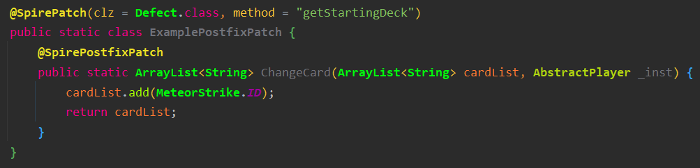

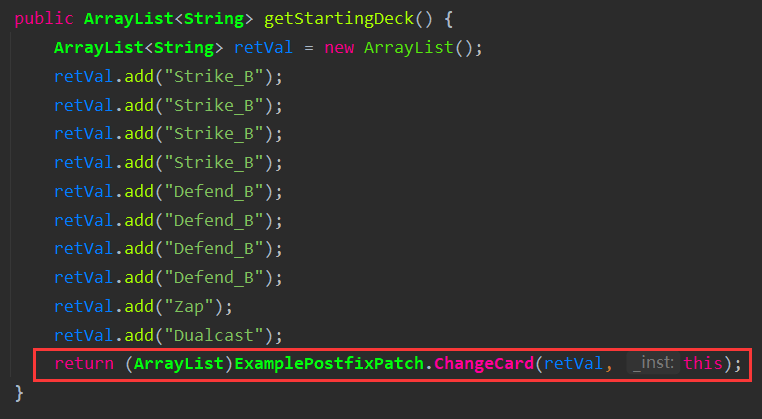

#### 可用特性

* [@ByRef](#byref)
* [Private Field Captures](#private-field-captures)

### Insert

------

Insert 允许你在原方法中间的任意位置插入你的 Patch 方法。Insert 总是在你给出的位置**之前**插入 Patch 方法。

**必须**使用 `@SpireInsertPatch` 注解来定义一个 Insert 类型的 Patch 方法。ModTheSpire 不会依据方法名判断该方法是否为 Insert 类型的 Patch 方法。

#### @SpireInsertPatch 参数

`loc` 、`rloc` 和 `locator` 三者中**必须有 1 个且同时只能有 1 个**参数被赋值。这三个参数都是用于让 ModTheSpire 知道你的 Patch 方法要在原方法的何处插入。其中 `loc` 是插入位置的绝对行数，`rloc` 是插入位置的相对行数，而 `locator` 是对插入位置的一个定位。你可以通过反编译来获取相应的行数。JD-GUI 反编译出的代码行数较为准确，推荐使用 JD-GUI. 如果碰上 JD-GUI 无法反编译的类或是 JD-GUI 反编译有明显错误的地方，可以使用 Luyten 进行反编译。

下面以 print 方法为模板，对 `loc` 和 `rloc` 进行说明。

```java
		public void print(params) {
120:		System.out.println("A");
121:		System.out.println("B");
			...
125:		System.out.println("F");
            // 在此处插入代码
126:		System.out.println("F");  
    	}
```

对于 `loc` ，你只需要传入绝对行数，即 `loc = 126` 行。若要使用 `rloc` ，那么你需要用该行的行数减掉原方法第一行的行数，在此例中为 126 - 120 = 6，即 `rloc = 6`. 也就是说，`rloc = 0` 意味着该 Insert Patch 会被插到原方法的开头。 一般来说，使用相对行数 `rloc` 的稳定性相较于使用绝对行数 `loc` 的稳定性高些，因此建议优先使用 `rloc` 而不是 `loc`.

你如果要在原方法的多个位置插入同样的 Patch 方法，那么可以使用 `locs` 或 `rlocs` 参数，两者均接收整形数组，例如 `locs = {121, 126}`. 使用 `locs` 或 `rlocs` 时，无需再定义 `loc` 和 `rloc`.

正如前面提到，Insert 类型的 Patch 方法会在给出的位置插入。插入后编译出的代码行数不会改变，也就是，允许多个 Insert Patch 插入同一行，先后顺序以 Mod 顺序为准，即

```java
126:	insert1(params);insert2(params);insert3(params);System.out.println("F");  
```

* `loc` 定义插入位置的绝对行数，从类文件的开头开始计算。
* `rloc` 定义插入位置相对于原方法开头的行数。
* `locs` 定义多个插入位置的绝对行数的数组。
* `rlocs` 定义多个插入位置的相对行数的数组。
* `localvars` 用于捕获任何局部变量并传递给 Patch 方法。捕获的变量以参数的形式传递给 Patch 方法，变量的参数在原方法参数之后。捕获的变量**必须在 Patch 方法插入的位置之前已经声明**。

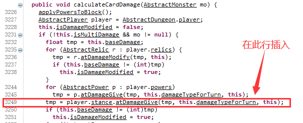

```java
@SpirePatch(clz = AbstractCard.class, method = "calculateCardDamage")
public static class ExampleInsertPatch {
    // 此处 rloc 也可以写成，rloc = 3249 - 3226，可能会更方便
    @SpireInsertPatch(rloc = 23, localvars = {"tmp"})
    // 注意捕获的局部变量要在 patch 方法的其他参数之后
    public static void ExampleInsert(AbstractCard _inst, AbstractMonster m, float tmp) {
        System.out.println("i am an insert patch method");
    }
}
```

#### 可用特性

* [@ByRef](#byref)
* [Private Field Captures](#private-field-captures)
* [SpireReturn](#spirereturn)

#### Locator

前面提到，`rloc` 的稳定性要优于 `loc`. 在很久以前，杀戮尖塔还经常更新的时候，代码改动导致行数变化是经常的事，这就可能会导致 `rloc` 在某次更新后定位到错误的位置。又或者，当 JD-GUI 的反编译出先问题，或你把握不准行数时，`rloc` 也有可能定位到错误的位置。你可以使用 `Locator` 来对插入位置进行一个定位。Locator 采用 Javassist 提供的 API ，传递原方法的 CtBehavior，并按照使用者给出的条件进行定位。Locator 会返回一个包含可能位置的行数的数组，该数组会被用于确定 Insert 类型的 Patch 方法的插入位置。通过填写 `@SpireInsertPatch` 的 `locator` 参数，你可以指定一个 Insert Patch 所要使用的 Locator. 当使用 `locator` 时，正如前文所述，你不能再定义 `loc` 或 `rloc` 等其他定位用的参数。

Locator 优于 `rloc` 的一点是，它允许你通过游戏代码的逻辑去定位，再此不过多赘述。

ModTheSpire 提供了一个有助于在 Locator 中快速定位行数的 API，`LineFinder`. LineFinder 提供了两个方法 `findInOrder` 和 `findAllInOrder` ，前者用于找到***首个***符合条件的位置所在的行数，后者用于按顺序找到***所有***符合条件的位置行数。条件由参数 `List<Matcher> expectedMatches` 和 `Matcher finalMatcher` 限定。Matcher 是一个工具类，提供了用于寻找代码中某个逻辑的便捷方法。

下面是对 AbstractCard 类中的 calculateCardDamage 方法插入使用了 Locator 的 Insert Patch 的示例。其中 Locator 用于定位从原方法的参数 `mo` 中第二次调用的域 `powers` 的所在的位置。

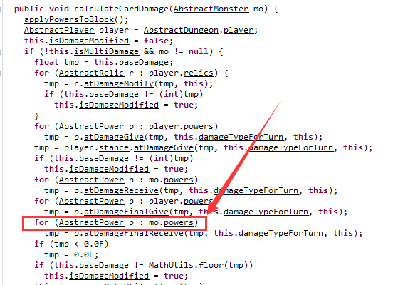

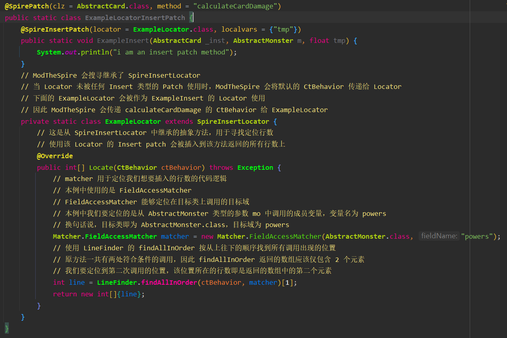

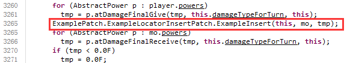

除了在 Insert Patch 中使用，Locator 以及 LineFinder 还可以在类似 Instrument 和 Raw 这类允许你直接使用 Javassist 的 Patch 中使用，即 Locator 和 LineFinder 并非 Insert 的限定工具。

更多类型的 Matcher 的介绍，请自己去翻 ModTheSpire 的 Wiki 上的[说明](https://github.com/kiooeht/ModTheSpire/wiki/Matcher)。

### Replace

------

Replace 会用 Patch 方法将原方法**完全替换**掉。在程序运行过程中，原方法体中的代码**全都不会**被调用，而是调用 Patch 方法，即 foobar(params) 会变成 replace(params). 下面的 Replace Patch 会完全替换掉 CardLibrary 类中 `getCardList` 方法的原代码。

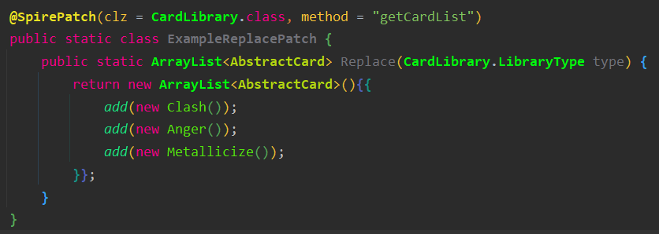

注意，按照 ModTheSpire 加载 Patch 的顺序，Replace 会覆盖掉对同一个方法生效的所有 Insert 和 Instrument 类型的 Patch.

警告：不要使用 Replace 类型的 Patch，除非是万不得已的情况。Replace 的破坏性会导致原方法的其他 Patch 失效或产生其他意料之外的效果。

### SpireField

------

SpireField 提供了一种为原版游戏中原先存在的类添加新的域的便捷方式。

SpireField 也是一种 Patch，因此需要将其写在一个 Patch 类内，但 @SpirePatch 的参数中的 `method` 需要使用 `SpirePatch.CLASS` 定义。

下例在 AbstractCard 类中新添加了一个类型为 String，名称中包含 example 的域。

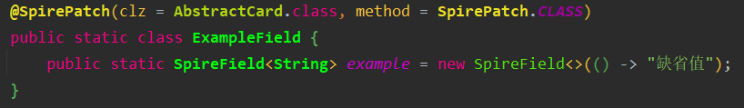

注意，新添加的域的名称在编译后的代码中并不完全和你在代码中写的名称一样。因为， 为了防止出现多个域同名的情况，ModTheSpire 会使用索引变更你提供的名称，因此不应该使用反射按照域的名称获取你添加的域。

可通过下面的方式访问和修改你添加的域：

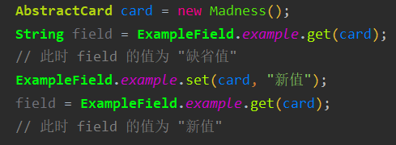

在添加基本数据类型的域时，需要使用其对应的包装类。

使用 SpireField 添加的域为动态域，要添加静态域需使用 StaticSpireField. 两者用法相差不大，这里不过多赘述。

### SpireOverride

------

SpireOverride 提供了重写父类私有方法的手段。例如：

```java
class A {
    private int baz(int i) { return i; }
}
class B extends A {
    // 不允许
    @Override
    private int baz(int i) { return i + 1; }
    
    // 可行
    @SpireOverride
    protected int baz(int i) { return i + 1; }
}
```

要在这类重写方法中调用父类的实现，使用 `SpireSuper.call(params)` 而不是 `super.method(params)`.

### SpireEnum

------

SpireEnum 是一种为尖塔源码中已有的枚举类添加新枚举值的手段，通过为一个静态域打上 `@SpireEnum` 注解来将该域变为原有枚举类的枚举值，同时，**该静态域的类型必须是目标枚举类型**。例如，为原版的枚举类 `AbstractPlayer.PlayerClass` 添加一个名为 `My_New_Player_Class` 的枚举，演示代码如下：

```java
public class MyEnums {
    @SpireEnum(name = "My_New_Player_Class")
    public static AbstractPlayer.PlayerClass MY_PLAYER;
}
```

上面的例子中，若 SpireEnum 的参数 `name` 留空（即不写），那么被新加进去的枚举名即为变量名，即 `MY_PLAYER` 而不是 `My_New_Player_Class`.

要在你的代码中调用由 SpireEnum 新加的枚举，按照调用静态域的方法来调用即可：

```java
public void foobar(AbstractPlayer.PlayerClass playerClass) {
    if (playerClass == MyEnums.MY_PLAYER) {
        ...
    }
}
```

**注意：不能也不可以将任何新的枚举值定义在任何从定义该枚举类型的类派生出的类中。**

换句话说，下面的代码是错误的，但不是语法错误，所以你的 IDE 不会提示你。

```java
// 定义枚举类型 PlayerClass 的类
public abstract class AbstractPlayer {
    ...;
    public static enum PlayerClass {
        IRONCLAD, THE_SILENT, DEFECT, WATCHER;
    }
}
// MyPlayer 是 AbstractPlayer 的派生类
public class MyPlayer extends AbstractPlayer {
    ...;
    // 此处的 patch 会失败，相当于没添加枚举值 MY_PLAYER 到原版的 PlayerClass 中
    @SpireEnum(name = "My_New_Player_Class")
    public static AbstractPlayer.PlayerClass MY_PLAYER;
}
```


## 4. Patch 可用的特性

### @ByRef

ByRef 允许 Patch 方法按引用接收参数的方法，当然，不是真的按引用接收，只是提供了变相修改参数引用的手段。ByRef 的参数以一个单一元素数组的形式传递给 Patch 方法。

* ByRef 适用于 Prefix、Postfix 和 Insert 类型的 Patch
* 参数前使用 `@ByRef` 注解以标明该参数为 ByRef 参数

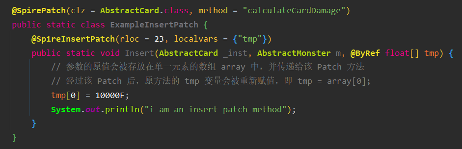

### Private Field Captures

Private Field Captures（PFC） 是 ModTheSpire 提供的一个特性，允许 Patch 将原方法所在类的私有域作为参数接收。

要接收某个私有域，需在 Patch 方法的参数列表中写入，与该私有域的变量名**同名同类型**的参数，并且该参数前需带有三个下划线，即 `fieldName` 写成 `___fieldName`.

* Prefix、Postfix 和 Insert 均可捕获私有域
* 接收私有域的参数写在原方法的参数之后
* 捕获的私有域可用 `@ByRef` 注解

#### 参数的顺序

Insert 类型的 Patch 方法中，PFC 的参数必须在任何接收局部变量的参数之前。即 Patch 方法的参数顺序应为：

1. 实例参数（若方法为非静态方法）
2. 原方法的参数
3. 接收私有域的参数
4. 接收局部变量的参数

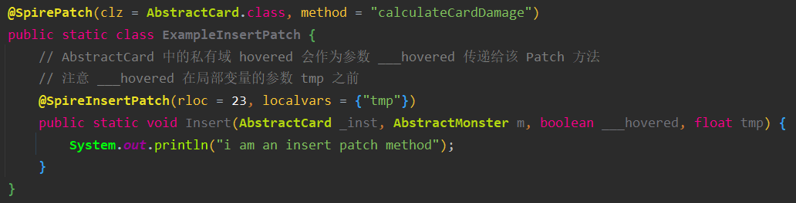

### SpireReturn

SpireReutn 允许 Patch 方法在原方法中提前调用 `return` 语句。

* SpireReturn 适用于 Prefix 和 Insert 类型的 Patch .（用脑子想想为什么不适用于 Postfix）

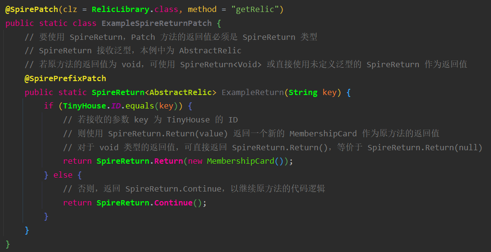

对于原方法返回值类型为基本数据类型的方法，需使用其对应的包装类定义 SpireReturn，例如：

```java
public static SpireReturn<Boolean> Insert() {...}
```


## 5. 进阶 Patch 技术

前文介绍的 Prefix、Postfix、Insert 和 Replace 类型的 Patch，只需读者有一定的 Java 基础就能勉强使用。**下面介绍的 Instrument 和 Raw 类型的 Patch 需要读者有一定的 Javassist 基础才能使用。同样地，本教程不过多对 Javassist 的内容进行教学**。


### Instrument

------

Instrument 允许你修改原方法中的代码，例如移除或替换某个方法的调用，或是修改等。详细的教程见：https://www.javassist.org/tutorial/tutorial2.html#alter

ModTheSpire 提供的 Instrument 是简化过的，只允许返回 ExprEditor. Patch 方法返回的 ExprEditor 会被用作原方法的 CtBehavior 的 instrument 方法的参数。想要更自由地使用 Instrument，需使用 Raw 类型的 Patch.

你可以使用 `@SpireInstrumentPatch` 注解来定义一个 Instrument 类型的 Patch 方法，或是将方法名写成 Instrument.

下面是对 UseCardAction 中的一个构造体进行修改的简单的 Instrument Patch. 当调用的方法名为`onUse` 或 `triggerOnCardPlayed` 和接收的参数符合一定的条件时，原调用方法才可被调用。

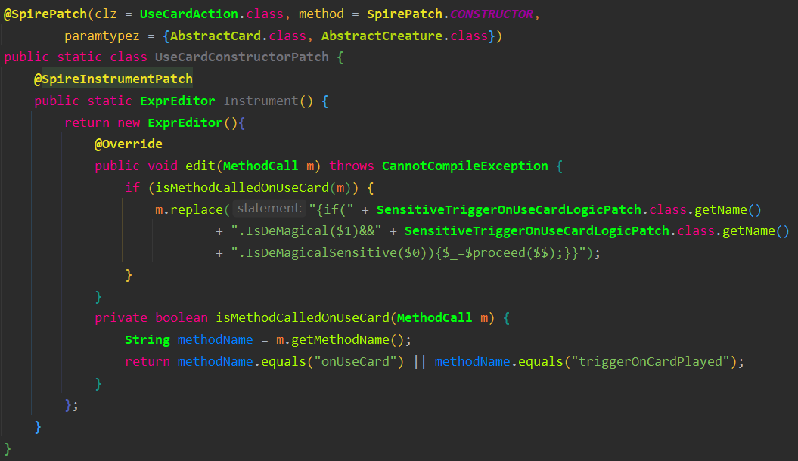

Instrument 类型的 Patch 只会在 ModTheSpire 编译的期间运行一次。

### Raw

------

Raw 放宽了条件，允许你更自由地使用 Javassist 提供的 API 进行低水平的修改，例如修改字节码。ModTheSpire 会将原方法的 CtBehavior 作为参数传递给 Raw 类型的 Patch 方法，然后你就可以自由地使用 Javassist 修改原版的代码。详细的说明见 [CtBehavior 的 Javadoc](http://www.javassist.org/html/javassist/CtBehavior.html) 和 [Javassist 的教程](https://www.javassist.org/tutorial/tutorial.html)。

你可以使用 `@SpireRawPatch` 注解来定义一个 Raw 类型的 Patch 方法，或是将方法名写成 Raw.

Raw Patch 允许访问字节码水平的修改，例如通过传递 CodeConvertor 作为 instrument 的参数，在遍历到某个符合条件的字节码时对源代码进行修改。下面是允许格挡突破 999 层上限的简单示例，可通过修改源代码中判断格挡层数的代码达成。

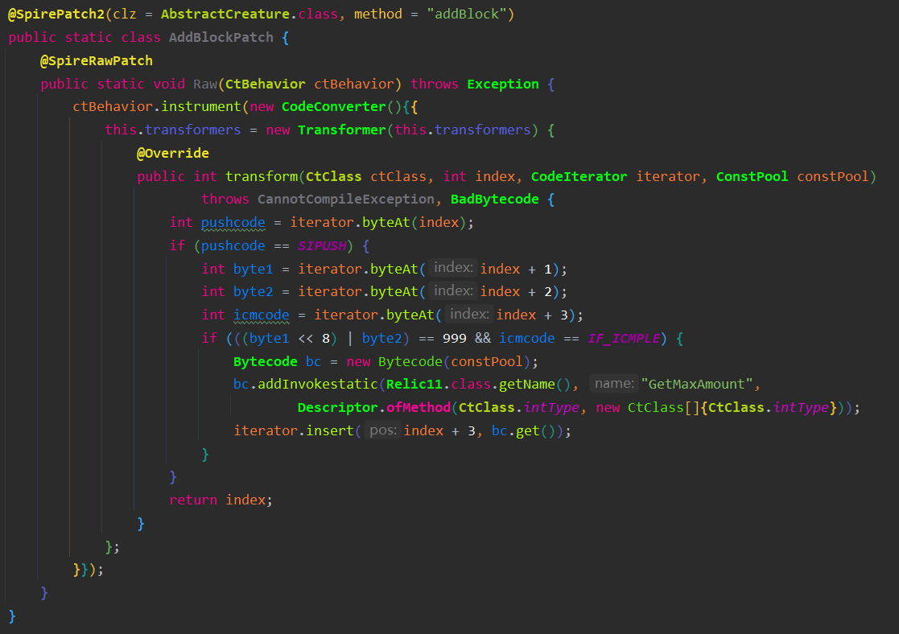

又或者为其他类添加新的方法，打上新的注解等。


同样地，Raw 类型的 Patch 只会在 ModTheSpire 编译的期间运行一次。


## 6. 编译 Patch 后的代码

ModTheSpire 在勾选 `debug` 启动时，会在游戏日志中显示每个 Patch 被应用的行数，尽管从技术上讲，这些信息已足以确认 Patch 应用在了正确的位置，但 `--out-jar` 能够让用户更方便直观地检查 Patch 的位置。

`--out-jar` 标记并不像 `debug` 一样直接显示在 ModTheSpire 的界面中，要使用 `--out-jar` 功能，需要在命令行启动 ModTheSpire，如：

```java
java -jar ModTheSpire.jar --out-jar
```

通过 `--out-jar` 启动的 ModTheSpire 并不会启动游戏，而是将所勾选 Mods 的 Patch 编译到游戏源码中（也就是给游戏打 Patch），然后将编译好的代码（即打完 Patch 的游戏代码）转存到 `desktop-1.0-patched.jar` 文件中。然后你就可以使用 JD-GUI 或 Luyten 反编译 `desktop-1.0-patched.jar` 从而查看被 Patch 后的游戏代码。


## FAQ
1. 我怎么知道我的 Patch 有没有被应用、有没有打到我想要的位置上？

   **答：** 请一字不拉地阅读 [编译 Patch 后的代码](#6-编译-patch-后的代码) 部分。

2. 如何修改原版代码中的某个局部变量的值？

   **答：** 请一字不拉地阅读 [Insert Patch](#insert) 部分，了解 `localvars` 的用法，以及 [@ByRef](#byref) 部分。

3. 什么是静态嵌套类？什么是静态方法？什么是静态初始化块？

   **答：**

   Java 基础不牢固导致的问题。以下为一图流简单解释。想要深入理解静态 `static` 关键字的工作原理请善用免费的搜索引擎。

   ```java
   public class WhatAreStatics {
       static String id;
       static int index;
       static Object obj;
       // 静态初始化块
       static {
           id = "STATIC FIELD";
           index = 10;
           obj = new Object();
       }
       
       String name;
       // 非静态初始化块
       {
           name = "Not static one";
       }
       
       // 静态方法
       public static void StaticVmethod() {
           ...
       }
       // 也是静态方法
       public static boolean StaticBool(String args) {
           ...
       }
        // 同样也是静态方法
       public static Object NameDoesntMatter(Object o1, Object o2, int i1) {
           ...
       }
       // 构造体不是静态方法！！！！！
       // 构造体不是静态方法！！！！！
       // 构造体不是静态方法！！！！！
       public WhatAreStatics() {
           ...
       }
       
       // 静态嵌套类
       public static class NestedClass {
           ...
       }
   }
   ```

   

4. 什么是原方法？什么是 Patch 方法？什么是 Patch 类？什么又是被 Patch 的类？什么又是 Patch 的类？

   **答：**

   甲往乙的脸上打了一拳。那么，

   乙的脸，就是原方法；

   甲打的那一拳，就是 Patch 方法；

   甲本身，就是 Patch 类；

   被打的乙本身，就是被 Patch 的类，也是很多语境下 Patch 的类。

   在诸如“你 Patch 的类是哪个类？”、“你 Patch 的类呢？”和“你要 Patch 哪个类？”此类语句中，Patch 作动词，表示往哪个类（哪位乙）上打 Patch. 当然，在不同的语境（不同上下文）下，这类说法亦有可能指代你写 Patch 的那个类（甲）而不是被 Patch 的类。

   

5. 原方法里用到了 `this` 关键字，可是 Patch 方法里不接收 `this` 参数，我该怎么办呢？

   **答：**

   非常经典的由 Java 基础不牢固导致的问题。如果你真的被这个问题困扰了很久，建议重学一遍 Java 再来写 Patch.

   Java 中的 `this` 关键字是指向类的对象本身，而这个对象本身，就是你在 Patch 方法中接收的实例，即Instance 参数。实际上，你在类中攥写的非静态方法也会隐式地接收一个指向该类实例化后的对象本身的参数，这个参数的表现形式就是 `this`. 因此你可以在这类方法中使用 `this` 关键字。不过非静态方法是隐式接收，即不需要你写在方法参数列表中，而 Patch 方法需要你显式地写在参数列表中。

   简而言之，**大部分情况下**，Patch 方法中接收的实例参数可等价**视为**原方法中的 `this` 关键字。

   

6. 我要 Patch 原版的 MeteorStrike 类的构造体，写了如下的 Patch，可是不成功，为什么呢？我明明是按着教程一步步来的呀？

   ```java
   @SpirePatch(clz = MeteorStrike.class, method = "MeteorStrike")
   public static class MeteorStrikePatch {
       @SpirePostfixPatch
       public static void Postfix(BootSequence _inst) {
           ...
       }
   }
   ```

   **答：**

   Java 基础不牢固，教程跳着看等多种因素导致的问题。

   本教程在第二部分 [SpirePatch 的一般规则](#2-spirepatch-的一般规则) 中就已经很明确地说明了这些非常基础的问题。下为原文。

   > Patch 方法接收所有**原方法（被 Patch 的方法）**的参数。当且仅当原方法是**非静态**方法，Patch 方法还接收（被）Patch 的**原方法所属的类的实例**（Instance）参数。示例如下。
   >
   > ```java
   > public static void [Patch方法名]([实例类型] __instance, [参数列表]...) {...}
   > ```

   > `method` 定义需要（被）Patch 的原方法 [名] ，接收 String 类型。
   >
   > * 使用 `SpirePatch.CONSTRUCTOR` 来定义构造体。
   > * 使用 `SpirePatch.STATICINITIALIZER` 来定义静态初始化块。
   > * 使用 `SpirePatch.CLASS` 来定义类。

   一步步分析，首先最明显的问题就是提问的人要 Patch 构造体，但给 `method` 赋了个 `"MeteorStrike"`，典型的将 Java 类的构造体（构造方法）和其他方法混为一谈的错误。

   其次，提问的人 Patch 的类是 `MeteorStrike` 但在Patch 方法里却接收了个 `BootSequence` 类型的实例参数，可能是典型的不动脑复制粘贴别人代码导致的错误。实际上，Patch 方法接收的实例参数类型除了是（被）Patch 的类，亦可以是该类的父类，即在本例中可为 `AbstractCard` 或 `Object`. 换句话说，实例的类型必须是可由（被）Patch 的类的类型转换而来的类型。

   综上，修改后正确的代码为：

   ```java
   @SpirePatch(clz = MeteorStrike.class, method = SpirePatch.CONSTRUCTOR)
   public static class MeteorStrikePatch {
       @SpirePostfixPatch
       public static void Postfix(MeteorStrike _inst) {
           ...
       }
   }
   ```

   或是：

   ```java
   @SpirePatch(clz = MeteorStrike.class, method = SpirePatch.CONSTRUCTOR)
   public static class MeteorStrikePatch {
       @SpirePostfixPatch
       public static void Postfix(AbstractCard _inst) {
           ...
       }
   }
   ```


7. 我想 Patch 原版 DrawPilePanel 中的 hasRelic 方法，我按照教程一步步来写了如下代码，可是为什么一直报错说找不到方法呢？
   

```java
@SpirePatch(clz = DrawPilePanel.class, method = "hasRelic", paramtypez = {String.class})
public static class SomeStrangePatch {
    @SpireInsertPatch(rloc = 0)
    public static SpireReturn<Boolean> Insert() {
        if (AbstractDungeon.player.hasPower("SomeStrangePower"))
            return SpireReturn.Return(true);
        return SpireReturn.Continue();
    }
}
```

（附原版代码如下）

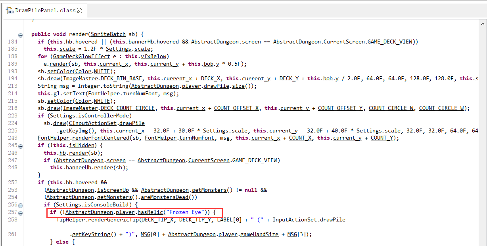

   **答：**
   不知道是作为星际深度玩家还是Java 基础不牢固，教程跳着看等多种因素导致的问题。

本教程在第二部分 [SpirePatch 的一般规则](#2-spirepatch-的一般规则) 中就已经很明确地说明了这些非常基础的问题。下为原文。

> * Patch 方法接收所有**原方法（被 Patch 的方法）**的参数。当且仅当原方法是**非静态**方法，Patch 方法还接收（被）Patch 的**原方法所属的类的实例**（Instance）参数。示例如下。
>
> ```java
> public static void [Patch方法名]([实例类型] __instance, [参数列表]...) {...}
> ```

> ### @SpirePatch 参数
>
> * `clz` 定义包含需要（被）Patch 的原方法的类，接收 Class<?> 类型。
> * `cls` 定义包含需要（被）Patch 的原方法的类，接收 String 类型。必须是完整的类路径和类名。
> * `method` 定义需要（被）Patch 的原方法 [名] ，接收 String 类型。

先说明一个 Java 中非常基础的概念——类的方法不是指所有在这个类的代码中出现的方法。

从上述例子来看，提问者所说的 `DrawPilePanel` 中的 `hasRelic` 方法显而易见地不是 `DrawPilePanel` 这个类的方法，而是在 `DrawPilePanel` 这个类中的 `render` 方法中被调用的方法。也就是，`DrawPilePanel` 这个类中的 `render` 方法通过 `AbstractPlayer` 类型的实例 `AbstractDungeon.player` 调用了 `hasRelic` 方法，那么很显然这个 `hasRelic` 其实是 `AbstractPlayer` 类的方法，而不是 `DrawPilePanel` 类中的方法，它只是在 `DrawPilePanel` 中被调用。而提问者所使用的 Patch 中的参数 `clz` 和 `method` 必须是一一对应的，所以它无法在 `DrawPilePanel` 这个类中找到不存在于 `DrawPilePanel` 中的 `hasRelic` 方法。

其次，非常明显地，`hasRelic` 是通过一个对象调用，而不是静态方法的 `类名.方法名` 的形式调用，换句话说，这个 `hasRelic` 不是个静态方法。按照本教程所述 SpirePatch 的一般规则，使用 @SpirePatch 而非 @SpirePatch2 时，Patch 方法必须接收原方法所属的类的实例作为一个参数。

再其次，即使 `hasRelic` 真的是 `DrawPilePanel` 中的静态方法，但依旧如同本教程所述，使用 @SpirePatch 而不是 @SpirePatch2 的 Patch 方法**要接收原方法的所有参数**，提问者都知道 `hasRelic` 会接收一个 `String` 类型的参数（还特地写在了 `paramtypez` 里），但却不知为何在自己的 Patch 方法中，也就是

```java
public static SpireReturn<Boolean> Insert() {
        if (AbstractDungeon.player.hasPower("SomeStrangePower"))
            return SpireReturn.Return(true);
        return SpireReturn.Continue();
}
```

不提供一个 `String` 类型的参数。

综上，在**无法揣测提问者原本想要的 Patch 效果的情况下**，提供一个**仅供参考**的修正版代码示例如下

```java
@SpirePatch(clz = AbstractPlayer.class, method = "hasRelic", paramtypez = {String.class})
public static class SomeStrangePatch {
    @SpireInsertPatch(rloc = 0)
    public static SpireReturn<Boolean> Insert(AbstractPlayer _inst, String s) {
        if (_inst.hasPower("SomeStrangePower"))
            return SpireReturn.Return(true);
        return SpireReturn.Continue();
    }
}
```

   

8. 写个 Patch 需要了解的名词和概念怎么这么多？这么多东西这么复杂还容易混淆谁记得住？

   **答：**

   诚然，在劝不学靡然成风的现状下，学习一些和尖塔 Mod 有关的 Java 基础，以及使用小学语文阅读理解能力耐心地阅读教程已然难于初中数学。
   
   总之，此问题碍于作者水平有限，无法解答，建议咨询师爷。

   不过作者还是建议各位读者不要受劝不学这类不良之风的影响，每天花费30分钟到1小时不等的时间，结合菜鸟教程等免费的在线 Java 教程，认真学一学 Java 的基础知识。简单的尖塔 Mod 所涉及的 Java 基础不多。实际上，Java 已经是最通俗易懂的面向对象编程语言了。

   

9. 暂无
